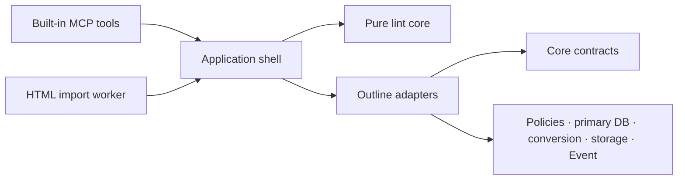

# Architecture Spine — Deterministic Wiki linting for Outline MCP

## Design Paradigm

Use **Functional Core, Imperative Shell** inside the existing Outline monolith.



Dependencies point inward: the core owns deterministic contracts and rule behavior; adapters translate authorized Outline state into those contracts; the application shell owns sequencing, transactions, failure policy, and effects. The core imports no Sequelize model, authorization policy, environment/config singleton, queue, Event, cache, logger, clock, network, or storage implementation.

## Invariants & Rules

### AD-1 — Functional Core, Imperative Shell [ADOPTED]

- **Binds:** all lint and enforcement paths.
- **Prevents:** read-only lint and write enforcement acquiring different rule semantics or effect boundaries.
- **Rule:** MCP handlers and workers call one application shell, which supplies immutable inputs to one pure core. All authorization, database, transaction, timeout, media, audit, and response effects remain outside the core.

### AD-2 — Authorized data boundary [ADOPTED]

- **Binds:** `lint_document`, `lint_wiki`, create/update enforcement, link and hierarchy rules.
- **Prevents:** rule code expanding authority or learning protected target state.
- **Rule:** the core receives only a validated immutable policy, a full `ProjectedDocument` or authorized `WikiSnapshot`, canonical syntax with safe locations, an access-collapsed link map, and an evaluation context/deadline. Existing Outline policies and membership-aware scopes run in adapters. Missing, deleted, and inaccessible targets become the same `unresolved` value before crossing the boundary.

### AD-3 — Closed rule and issue registry [ADOPTED]

- **Binds:** OD-1, configuration, result contracts, fixtures, audit aggregates.
- **Prevents:** per-collection severity drift, client-defined behavior, arbitrary code/regex execution, and issue-code reuse.
- **Rule:** a code-owned discriminated-union registry defines every rule kind, parameter validator, fixed severity, emitted code, and semantic description. Configuration may select registered kinds and parameters only; it cannot provide executable code, arbitrary regular expressions, issue codes, or severity overrides. A material semantic change creates a new code.

| Class | Stable code | Location | Fixed meaning |
| --- | --- | --- | --- |
| Error | `REQUIRED_SECTION_MISSING` | `document` | A configured required section is absent. |
| Error | `SECTION_ORDER_INVALID` | `text` | Configured sections are present in a forbidden order. |
| Error | `HEADING_LEVEL_NOT_ALLOWED` | `text` | A heading uses a level outside the configured allowed set. |
| Error | `REQUIRED_METADATA_FIELD_MISSING` | `document` | A configured visible metadata field is absent. |
| Error | `METADATA_FIELD_FORMAT_INVALID` | `text` | A visible metadata value fails its registered deterministic format. |
| Error | `MARKDOWN_STRUCTURE_UNSUPPORTED` | `text` | Canonical Markdown contains a configured unsupported structure. |
| Error | `INTERNAL_LINK_TARGET_UNRESOLVED` | `text` | A visible internal link cannot be safely resolved for the actor. |
| Error | `PARENT_DOCUMENT_UNRESOLVED` | `relationship` | An evaluated document's parent cannot be safely resolved in scope. |
| Error | `HIERARCHY_CYCLE` | `relationship` | The authorized hierarchy graph contains a cycle. |
| Error | `PUBLISHED_DOCUMENT_MISSING_FROM_STRUCTURE` | `relationship` | An authorized published document is absent from authoritative collection structure. |
| Error | `PARENT_COLLECTION_MISMATCH` | `relationship` | An authorized parent relationship crosses collections inconsistently. |
| Error | `GLOBAL_INDEX_LINK_MISSING` | `relationship` | An authorized surface document lacks a direct link to an authorized configured global index. |
| Warning | `DISCOURAGED_MARKDOWN_STRUCTURE` | `text` | Canonical Markdown contains a configured discouraged, but permitted, structure. |
| System Failure | `POLICY_CONFIGURATION_INVALID` | `scope` | An identifiable collection policy is invalid or its effective fingerprint cannot be established consistently. |
| System Failure | `POLICY_SCHEMA_VERSION_UNSUPPORTED` | `scope` | The configuration schema version is unsupported; root-level occurrence is startup-fatal. |
| System Failure | `VALIDATION_RUNTIME_FAILED` | `scope` | An unexpected validation or authorized-data operation failed. |
| System Failure | `VALIDATION_TIMEOUT` | `scope` | The server-owned validation deadline expired. |
| System Failure | `VALIDATION_RESOURCE_LIMIT_EXCEEDED` | `scope` | A code-owned resource or concurrency limit was exceeded. |

`POLICY_NOT_CONFIGURED` is a stable `not_evaluated` reason, not a System Failure.

### AD-4 — Safe locations and deterministic order [ADOPTED]

- **Binds:** all Findings and System Failures.
- **Prevents:** client-visible ordering drift, fabricated source positions, and protected identity leakage.
- **Rule:** locations are exactly `text { documentId, line, column, path? }`, `document { documentId }`, `relationship { documentId, relationshipKind }`, or `scope { scopeKind, collectionId? }`. `relationshipKind` is `parent | collection_structure | global_index`; `scopeKind` is `document | collection | configured_collections`. Line/column are one-based coordinates in canonical Outline Markdown; `path` is an array of string/integer segments. Every identifier present is actor-authorized. Relationship locations name the authorized source, never a protected target. Each of `errors`, `warnings`, and `systemFailures` is sorted by authorized collection ID, document ID, line, column, structural path, location-kind rank, issue code, then rule-local ordinal; absent values sort last and strings use bytewise UTF-8 comparison. Titles, messages, database order, locale, and timing never affect order.

### AD-5 — Startup-loaded policy configuration [ADOPTED]

- **Binds:** FR-11 through FR-13 and all collection-specific behavior.
- **Prevents:** request-controlled policy, silent partial parsing, and a malformed entry disabling unrelated collections.
- **Rule:** optional `WIKI_LINT_CONFIG_PATH` points to one schema-version-1 JSON file loaded once at startup; there is no watcher or mutation API. An absent path means no Configured Collections. The v1 envelope is exactly `{ schemaVersion: 1, collections: Record<UUID, CollectionPolicy> }`; `CollectionPolicy` requires `activation`, defaults omitted `runtimeFailureMode` to `closed`, and requires a non-empty `rules` array of unique registered kinds whose exact closed parameter schemas live in the AD-3 registry. Unknown fields and non-integer numbers are invalid at every level. A duplicate-aware JSON decoder rejects duplicate object keys before materialization. Root unreadability/malformed JSON, unsupported root schema, or duplicate/unidentifiable collection keys blocks startup. After a valid envelope is established, entries validate independently: a valid entry becomes immutable policy; an identifiable invalid entry becomes an immutable fail-closed sentinel for that collection; other valid or absent collections remain unaffected.

`activation` is `read_only | enforced`; `runtimeFailureMode` is `closed | open` and defaults to `closed`. Neither is accepted from MCP input.

### AD-6 — Policy identity and lifecycle [ADOPTED]

- **Binds:** responses, audit summaries, rollout evidence, multi-instance consistency.
- **Prevents:** operators or clients comparing policies by mutable labels or raw configuration.
- **Rule:** canonical JSON has no whitespace; recursively sorts object keys by the UTF-8 bytes of their unescaped scalar sequence; preserves array order; rejects lone surrogates and performs no Unicode normalization. Strings escape quote, reverse-solidus, and U+0000–U+001F using the shortest JSON escape (lowercase `\u00xx` when no short escape exists); other scalars are emitted as UTF-8. Integers use base 10 without leading zeroes; booleans are lowercase; null is `null`. `policyFingerprint = sha256:<lowercase-hex>` over canonical UTF-8 `{ schemaVersion, activation, runtimeFailureMode, rules }`. A parseable invalid entry has `invalidFingerprint` over its canonical raw JSON value and exposes only that hash, stable code, and schema path. `policySetFingerprint` hashes canonical `{ schemaVersion, collections }`, where `collections` is an array sorted by collection UUID and each item is `{ collectionId, status: "valid", policyFingerprint }` or `{ collectionId, status: "invalid", invalidFingerprint }`. Raw configuration is never returned or logged. A rollout is incomplete until every serving instance reports the expected policy-set fingerprint.

### AD-7 — One side-effect-free Projected Document [ADOPTED]

- **Binds:** MCP `create_document`, `update_document`, templates, HTML import, every edit mode.
- **Prevents:** validation of fragments, validation/persistence drift, and rejected writes leaving visible media or records.
- **Rule:** an enforced write builds one full `ProjectedDocument` using the baseline's exact template substitution, canonical Markdown/ProseMirror conversion, publish/unpublish behavior, and `replace`, `append`, `prepend`, and `patch` semantics. The validated projection contains final title, body/content/state, collection, parent, publication state, and relationships; persistence stores that projection without reapplying the edit. Implement a new `stage -> project -> validate -> materialize` media protocol: every staged blob is owned by `invocationId`, remains Outline-inaccessible, transfers ownership only when its Attachment row commits, and is otherwise deleted idempotently in cleanup. The shared HTML import job gains a server-only caller intent: baseline API mode remains unchanged; MCP-enforced mode carries request/invocation IDs, `actorId`, `sourceIp`, expected policy fingerprint, and auth envelope `{ credentialAuthType: "api" } | { credentialAuthType: "oauth", authenticatedClientId }`. It carries no access/API token, secret, cookie, authorization header, or client-claimed identity. The worker reloads the actor, re-authorizes the destination, and requires its current policy fingerprint to match before materialization; mismatch is `POLICY_CONFIGURATION_INVALID` and never fail-open. It returns the structured validation outcome with the document ID when persisted. Client input cannot select this mode.

### AD-8 — Enforced-write transaction and concurrency [ADOPTED]

- **Binds:** configured MCP create/update persistence.
- **Prevents:** TOCTOU between projection and save, concurrent lost updates, and successful events for rejected mutations.
- **Rule:** for an `enforced` post-operation collection, one primary-DB transaction re-fetches and re-authorizes all mutation inputs, locks the update document row, builds the authoritative projection from prepared data, reads required related state, validates, and persists through existing save/publish hooks. Error or fail-closed System Failure rolls back; success is returned only after commit. Slow conversion/network/staging stays outside, but every assumption is revalidated inside. `read_only` and unconfigured writes retain baseline behavior and response shape; enforcement remains MCP-only.

### AD-9 — Minimal authorized WikiSnapshot [ADOPTED]

- **Binds:** cross-document links, hierarchy integrity, global-index coverage.
- **Prevents:** whole-workspace overfetch, cache/replica inconsistency, and hidden resource disclosure.
- **Rule:** a dedicated adapter loads only actor-readable configured scope and rule-required fields from the primary DB, batch-resolves identifiers through existing membership-aware queries, and reads authoritative uncached `Collection.documentStructure`. The core receives only authorized graph nodes/edges and collapsed resolution states. Hierarchy checks operate on the authorized graph. `GLOBAL_INDEX_LINK_MISSING` is emitted only when every fact needed to prove it is authorized and resolved; otherwise that check is incomplete with a generic safe System Failure.

### AD-10 — One point-in-time snapshot per `lint_wiki` [ADOPTED]

- **Binds:** OD-3, clean-state semantics, concurrent change handling.
- **Prevents:** a clean result assembled from mutually inconsistent document, link, and hierarchy reads.
- **Rule:** each `lint_wiki` invocation materializes its complete authorized input in one primary-DB, read-only `REPEATABLE READ` transaction: scope, authoritative `content/state`, baseline serialization to canonical Markdown, authoritative hierarchy/structure, deterministic batched link extraction, and target resolution. It never treats asynchronously refreshed `Document.text` as snapshot authority. The transaction performs no network/storage work or full rule evaluation; it commits only after all snapshot-dependent lookups, then the core evaluates the immutable snapshot. `lint_document` uses the same mechanism for one document and its authorized dependencies. Concurrent commits after snapshot creation do not invalidate point-in-time meaning. `complete: true` is permitted only when every required input came from that snapshot; inability to establish it returns `VALIDATION_RUNTIME_FAILED`, `complete: false`.

### AD-11 — Server-owned timeout and partial-result semantics [ADOPTED]

- **Binds:** OD-3, `lint_wiki`, transport/deployment configuration.
- **Prevents:** client-selected execution budgets, transport aborts without a result, and partial work masquerading as clean.
- **Rule:** `lint_wiki` has a non-client-configurable 60-second hard deadline; `/mcp` transport timeout is at least 65 seconds, and each DB/stage deadline is capped by remaining time. Its ordered atomic-unit list is: every document (all enabled document/link rules as one buffered unit), then each collection's hierarchy check, then its global-index check, all in AD-4 key order. The deadline is checked before each unit; an interrupted unit contributes nothing. Timeout returns the longest fully completed prefix, adds `VALIDATION_TIMEOUT`, and sets `complete`/`clean` false. Isolated failures do not suppress later independent units; a global snapshot failure may return no findings.

### AD-12 — Explicit result algebra [ADOPTED]

- **Binds:** MCP response contracts and client branching.
- **Prevents:** interpreting prose, empty arrays, or protocol error state as validation outcome.
- **Rule:** `Finding` is exactly `{ code, severity: "error" | "warning", message, location }`; `SystemFailure` is `{ code, message, location }`. `PolicyIdentity` is `{ collectionId, status: "valid", policySchemaVersion: 1, policyFingerprint } | { collectionId, status: "invalid", invalidFingerprint }`, sorted by collection ID and containing authorized IDs only. `EvaluatedScope` is `{ kind: "document", documentId, collectionId, evaluatedDocumentCount, evaluatedLinkCount }`, `{ kind: "collection", collectionId, evaluatedDocumentCount, evaluatedLinkCount, completedChecks }`, or `{ kind: "configured_collections", collections: [{ collectionId, evaluatedDocumentCount, evaluatedLinkCount, completedChecks }] }`; `completedChecks` is an ordered subset of `documents | hierarchy | global_index`, and counts include completed AD-11 units only. Read-only results carry `state: complete | incomplete | failed | not_evaluated`, booleans `complete` and `clean`, always-present ordered `errors`, `warnings`, `systemFailures`, `scope: EvaluatedScope`, and `policies: PolicyIdentity[]`. The algebra is closed: `not_evaluated` means policy absent, `complete=false`, `clean=false`, and all issue arrays/policies empty; `complete` means every required unit ran and System Failures are empty, with `clean = (errors.length === 0)`; `incomplete` means at least one atomic unit completed and at least one System Failure exists; `failed` means no atomic unit completed and at least one System Failure exists. Both incomplete/failed have `complete=false`, `clean=false`; Warnings never affect clean. Modeled outcomes are normal MCP tool results; `isError` is reserved for invalid calls, authorization denial, or an unmodellable failure.

Enforced-write responses add:

```text
validation.status = validated | validated_with_warnings | degraded_validation | rejected
validation.policySchemaVersion
validation.policyFingerprint
validation.errors[]
validation.warnings[]
validation.systemFailures[]
```

Successful writes preserve existing document fields and add `validation`; patch preserves its final-Markdown block. Policy rejection returns `{ success: false, validation }` as a modeled result without nonexistent document fields. `read_only` and unconfigured writes add nothing.

### AD-13 — Central write-decision matrix [ADOPTED]

- **Binds:** all enforced-write allow/reject decisions.
- **Prevents:** broad or handler-specific fail-open behavior.
- **Rule:** one pure decision function combines validation classification with the immutable post-operation collection policy.

| Validation result | `closed` | `open` |
| --- | --- | --- |
| Complete, no Errors or Warnings | `validated`, persist | `validated`, persist |
| Complete, Warnings only | `validated_with_warnings`, persist | `validated_with_warnings`, persist |
| Any known Error | `rejected` | `rejected` |
| Invalid configuration | `rejected` | `rejected` |
| Runtime System Failure, no known Error | `rejected` | `degraded_validation`, persist |
| Runtime System Failure plus known Error | `rejected` | `rejected` |

Only `VALIDATION_RUNTIME_FAILED`, `VALIDATION_TIMEOUT`, and `VALIDATION_RESOURCE_LIMIT_EXCEEDED` are fail-open eligible. Authorization, input, conflict, persistence, invalid configuration, and audit failures are not. `degraded_validation` dominates Warnings and returns the triggering safe System Failure.

### AD-14 — Minimized durable Event summaries [ADOPTED]

- **Binds:** OD-4 and FR-19 through FR-21.
- **Prevents:** a second audit subsystem, non-queryable evidence, and persistence of protected lint detail.
- **Rule:** persist exactly one idempotent summary under `wikiLint.document`, `wikiLint.wiki`, or `wikiLint.write_validation`. A server-generated `requestId` identifies the HTTP request; a server-generated `invocationId` is also the audit Event ID. Safe document/collection IDs use existing Event columns. Successful baseline mutation Event data carries only `validationCorrelationId = invocationId`. Add index `events(teamId, name, createdAt)` and retain existing Event retention. Event `data` is exactly:

```text
AuditDataV1 {
  schemaVersion: 1
  requestId: UUID
  operation: lint_document | lint_wiki | create_document | update_document
  outcome: clean | findings | not_evaluated | incomplete | failed |
           validated | validated_with_warnings | degraded_validation | rejected
  complete: boolean
  durationMs: non-negative integer
  scopeKind: document | collection | configured_collections
  policySchemaVersion?: 1
  policyFingerprint?: sha256:<lowercase-hex>
  evaluatedDocumentCount: non-negative integer
  evaluatedLinkCount: non-negative integer
  counts: { errors, warnings, systemFailures, byCode: { <stable-code>: count } }
  runtimeFailOpenExercised: boolean
  credentialAuthType: oauth | api
  authenticatedClientId?: string
}
```

No additional key may carry bodies, excerpts, messages, locations, raw config/request, or unresolved target identity.

### AD-15 — Narrow audit access and failure isolation [ADOPTED]

- **Binds:** audit retrieval, client attribution, operational diagnostics.
- **Prevents:** broadening self-hosted access to every audit event, trusting client claims, or audit failure changing functional behavior.
- **Rule:** add `auditWikiLint` to `events.list`; a same-team admin may use it only for the three AD-14 names, while existing full `audit` policy remains unchanged. Extend the private authentication result and MCP `AuthInfo.extra` to propagate `credentialAuthType: oauth | api` and, only for OAuth, the `OAuthClient.clientId` bound to the access token; the command context may continue to label document mutations as MCP. API credentials omit client identity. Ignore `User-Agent`, MCP client claims, `_meta`, and tool arguments for attribution. Audit persistence runs after read completion or write commit/rejection rollback in an independent transaction. Failure produces only minimized correlated operator diagnostics and never changes the MCP result. Crash-after-commit-before-audit remains an explicit evidence gap.

### AD-16 — Bounded query and memory plan [ADOPTED]

- **Binds:** snapshot construction and per-process load control.
- **Prevents:** N+1 queries, unbounded AST retention, and concurrent scans exhausting a server process.
- **Rule:** use keyset order `(collectionId, id)`, batches of 100 documents and 500 unique link targets, request-local maps only, and transient per-document ASTs; do not use unbounded `Promise.all`. Admit at most one concurrent `lint_wiki` per server process. Code-owned hard limits are 5,000 documents, 1 MiB UTF-8 Markdown per document, 64 MiB total Markdown, 100,000 internal-link references, and 10,000 authoritative structure nodes. Exceeding admission or a limit yields `VALIDATION_RESOURCE_LIMIT_EXCEEDED`, `complete: false`; none is a client or policy parameter.

### AD-17 — Reproducible performance gate [ADOPTED]

- **Binds:** OD-5, NFR-1 through NFR-5, Gate 1 evidence.
- **Prevents:** performance claims tied to an unnamed machine, cache state, dataset, or percentile method.
- **Rule:** benchmark a production build on Linux x86-64 with the app limited to two dedicated vCPU/4 GiB and PostgreSQL 14.2 to two dedicated vCPU/4 GiB/local SSD, same host, no artificial latency or competing traffic, using baseline Node/Yarn. A seeded generator creates 3 collections/150 documents and 10 collections/1,000 documents, average eight internal links/document, Markdown median/p95/max 8/32/128 KiB, hierarchy depth at most 12, and every rule/resolution class. After five warmups, run 40 sequential warm-cache samples; nearest-rank p95 is item `ceil(0.95*N)`, with one cold run and peak-RSS/query/document/link-normalized reporting. Gate 150 at p95 <=10 s and every measured 1,000-document run <=60 s; also report concurrent writer latency during snapshot assembly. On the same fixture, 40 stratified `lint_document` invocations (20 median-size, 16 p95-size, 4 max-size; eight links/document) gate at p95 <=1 s. Paired baseline/enabled measurements cover Markdown create and all update modes; HTML/import is separate; validation overhead p95 remains <=500 ms. The retained manifest includes source/image commit and digest, fixture-generator commit/seed and dataset hash, policy fingerprint, Node/Yarn/PostgreSQL versions, CPU/kernel/container limits, relevant DB settings, exact command, warmups/sample count, and every raw timing/RSS/query sample.

### AD-18 — Layered conformance evidence [ADOPTED]

- **Binds:** Gate 1 and every boundary above.
- **Prevents:** tests proving private implementation details while missing baseline, authority, atomicity, or determinism regressions.
- **Rule:** collocated tests must cover: pure-core code/severity/location/order fixtures; a forbidden-import dependency check; configuration/fingerprint cases including duplicate keys; projection parity against the actual baseline writer for create/templates/publish/unpublish/all edit modes; visible-metadata survival through the actual Markdown/ProseMirror round trip, with no special front-matter semantics absent equivalent proof; multi-actor adapter disclosure; row-lock/rollback/concurrent-snapshot behavior; the new HTML-worker intent and media stage/materialize/cleanup protocol; audit idempotence/access/failure injection; exact unconfigured and `read_only` compatibility; single-`/mcp` discovery; and malicious user-controlled `href`/`src` rendering through `sanitizeUrl()` or an existing wrapper proven to call it. Use only minimal injected snapshot reader, deadline/clock, audit writer, and media stager seams. Gate-1 evidence must prove merge-base exactly `4a5a616a21be800257dc11cef4263d0dd0412156`, identify every separately approved/tested backport, record toolchain/commands/results/benchmarks/generic-data review, and exclude the post-`v1.10.1` container-block patch-edit fix from the first increment.

### AD-19 — Deployment does not enable policy [ADOPTED]

- **Binds:** configuration packaging, readiness, multi-instance rollout, delivery gates.
- **Prevents:** image publication/deployment silently enabling lint or mixed-policy instances serving one rollout.
- **Rule:** the image contains implementation plus generic schema/example and no pilot policy. `WIKI_LINT_CONFIG_PATH` is an optional read-only mount; policy changes require restart and there is no admin API/hot reload. Startup reports only config status, activation counts, and a `policySetFingerprint`; readiness may require `WIKI_LINT_EXPECTED_CONFIG_FINGERPRINT`. Instances with different fingerprints may not simultaneously serve the same policy rollout; OD-7 selects blue/green or drain-and-replace. Implementation readiness, immutable image publication, deployment with no active collection policy, `read_only` rollout, and later per-collection `enforced` rollout are separate approvals. Disabling enforcement is an approved `read_only` config change/restart; image rollback is separate.

## Consistency Conventions

| Concern | Convention |
| --- | --- |
| IDs | Existing Outline UUIDs; no private IDs in reusable code, public schemas, descriptions, examples, or fixtures. |
| Text | Canonical Outline Markdown is the diagnostic coordinate system; ProseMirror conversion remains baseline-owned. |
| Comparison | Bytewise UTF-8; never locale-sensitive. |
| Time | Runtime metadata is excluded from deterministic normalized results; deadlines use a monotonic clock. |
| Errors | Findings, System Failures, upstream errors, and audit failures remain disjoint. |
| Transactions | Primary DB for authoritative snapshots/writes; no replica or cached hierarchy in validation decisions. |
| Logging | IDs only when already authorized/operationally required; never content, raw config, request body, location, or protected target data. |
| Tests | Collocated with covered code; deterministic generated data uses a fixed seed. |

## Stack

| Name | Version |
| --- | --- |
| Outline source baseline | `v1.10.1^{}` / `4a5a616a21be800257dc11cef4263d0dd0412156` |
| Node.js production runner | `26.3.0` |
| Yarn | `4.11.0` |
| TypeScript | `6.0.3` |
| MCP TypeScript SDK | `1.29.0` |
| Sequelize | `6.37.8` |
| Zod | `4.5.4` |
| markdown-it | `14.3.0` |
| PostgreSQL performance reference | `14.2` |

Versions are verified from the selected repository commit's `Dockerfile`, `package.json`, `yarn.lock`, and CI configuration; this brownfield feature adds no framework or external service.

## Structural Seed

```text
server/
  wikiLint/
    core/          # pure contracts, registry, projection-independent rules, ordering
    application/   # lint/write orchestration and decision algebra
    adapters/      # Outline auth/DB/config/media/Event translations
  tools/
    wikiLint.ts    # lint_document and lint_wiki registration
    documents.ts   # existing create/update tools call enforcement orchestration
```

Tests remain beside the source they cover. Existing route, command, model, editor, migration, and worker locations remain authoritative; no parallel framework tree is introduced.

## Capability → Architecture Map

| Capability / Area | Lives in | Governed by |
| --- | --- | --- |
| Deterministic contract and issue identity | Core registry/result contracts | AD-3, AD-4, AD-12 |
| `lint_document` | MCP tool + application shell + authorized adapter | AD-1, AD-2, AD-9, AD-12 |
| `lint_wiki` and hierarchy/global checks | Snapshot adapter + pure core | AD-9, AD-10, AD-11, AD-16 |
| Policy scope/config/failure behavior | Config adapter + decision algebra | AD-5, AD-6, AD-13 |
| MCP create/update enforcement | Existing document tools + projection/write orchestration | AD-7, AD-8, AD-12, AD-13 |
| Durable audit evidence | Event adapter + existing `events.list` | AD-14, AD-15 |
| Performance and growth evidence | Benchmark fixtures/harness | AD-16, AD-17 |
| Security, compatibility, baseline proof | Collocated conformance tests | AD-2, AD-9, AD-18 |
| Publication, deployment, rollout | Startup/readiness + operator gates | AD-19 |

## Deferred

| ID | Deferred decision | Owner and revisit condition |
| --- | --- | --- |
| D-1 / OD-2 | Actual pilot collections, rules/parameters, identifiers, templates, and fail-open posture. | Wiki operator before Gate 4. |
| D-2 / OD-6 | Two supported pilot clients and restricted Logical Change Batch evidence procedure. | Wiki operator before Gate 4. |
| D-3 / OD-7 | Registry, image naming, target environment, change window, backup/restore, and rollback procedure. | Release operator before Gate 2 or 3 as applicable. |
| D-4 | Enforcement in UI, direct API, or lower-level shared writers. | New product and blast-radius approval. |
| D-5 | Anchor/fuzzy matching, semantic classification, secret scanning, and Wiki quality statistics. | New scoped product requirement. |
| D-6 | Durable outbox eliminating the post-commit audit crash window. | Revisit only if pilot evidence gaps are unacceptable without weakening functional failure isolation. |
| D-7 | Parallel rule evaluation or cross-instance lint admission coordination. | Revisit only if AD-17 evidence shows the sequential/per-process design cannot meet load goals. |
| D-8 | Baseline upgrade or upstream backport, including the post-`v1.10.1` container-block patch-edit fix. | Each change requires separate approval, diff, and baseline-specific tests; never merge/rebase onto `upstream/main`; the patch-edit fix is excluded from the first increment. |
